# Lab5
# Mengenal Java Script

*Pertama-tama membuat document tag HTML dengan nama file lab5_javascript.html*

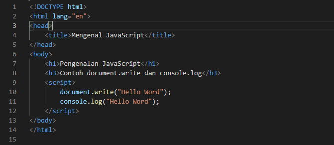

lalu lihat di web Browser

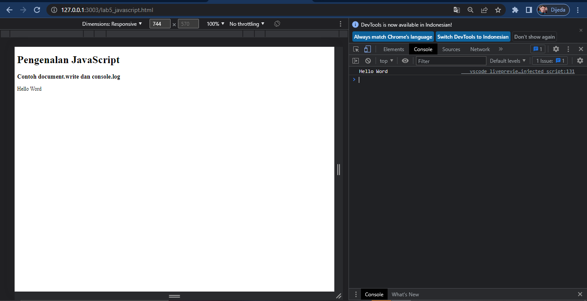

## Javascript Dasar

*Penggunaan Alert sebagai properti window.*

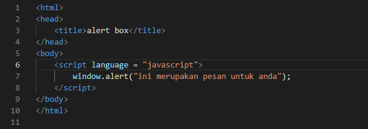

Maka tampilannya seperti berikut.

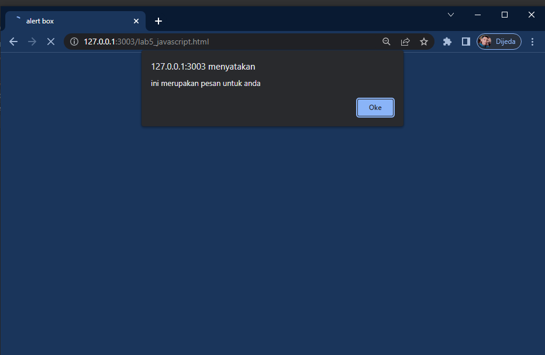

*Penggunaan Method dalam suatu objek*

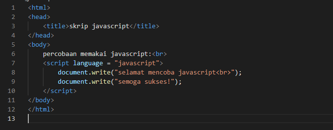

dan tampilannya seperti ini

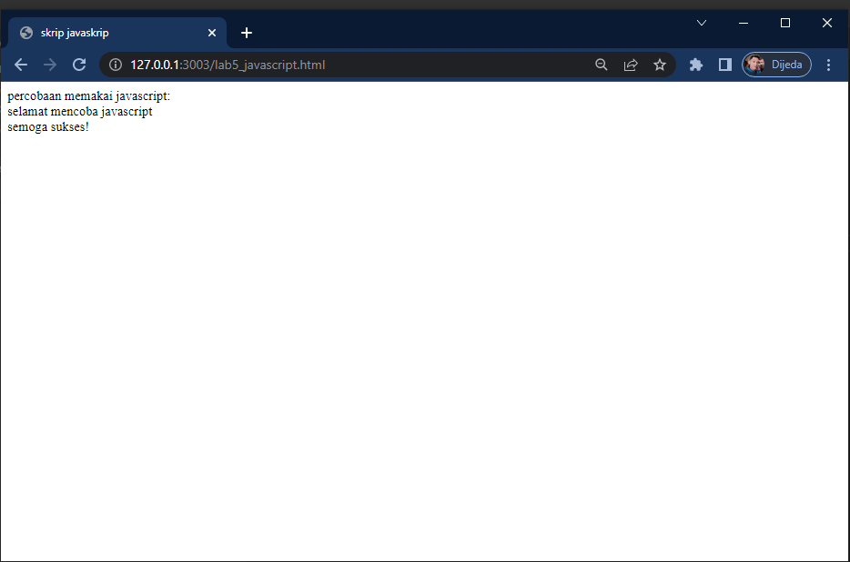

*Pemakain Prompt*

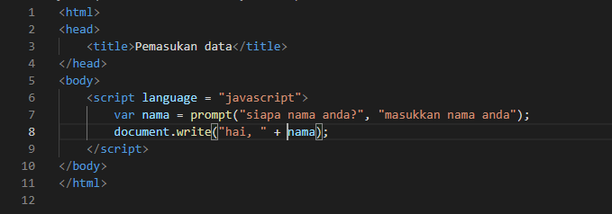

tampilannya 

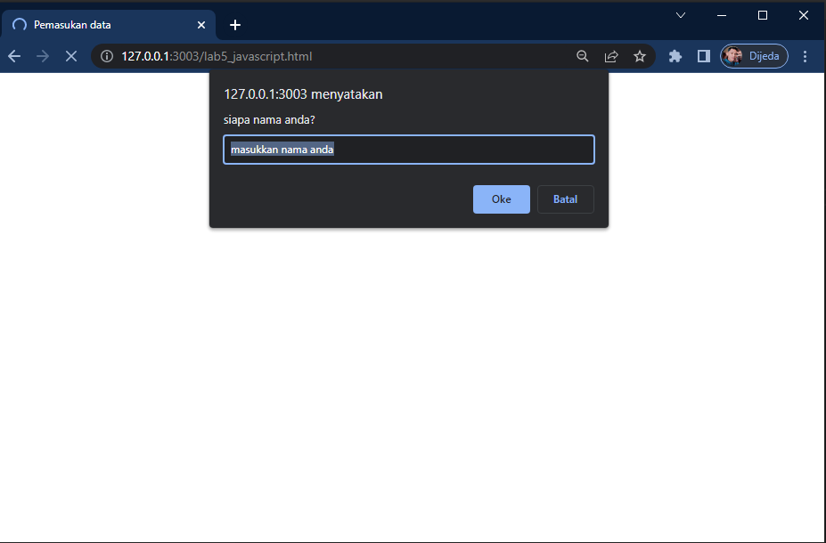

*Pembuatan fungsi dan cara pemanggilannya*

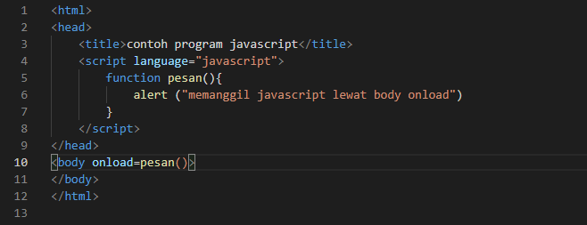

Tampilannya

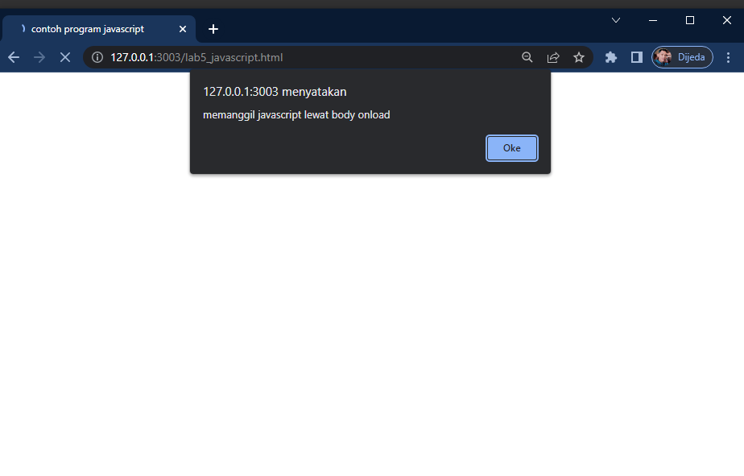

*Pembuatan dasar aritmatika*

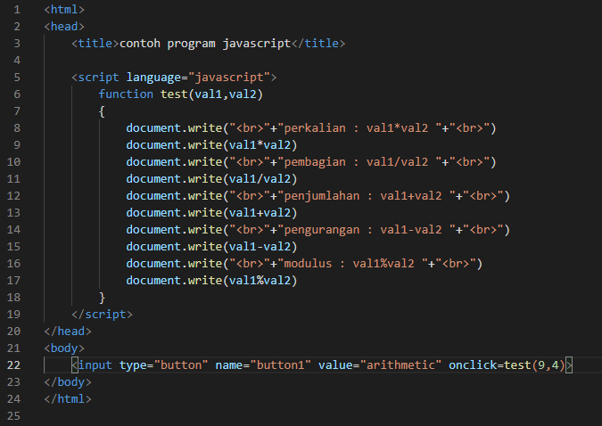

Tampilannya seperti ini, lalu klik *Aritmatik*

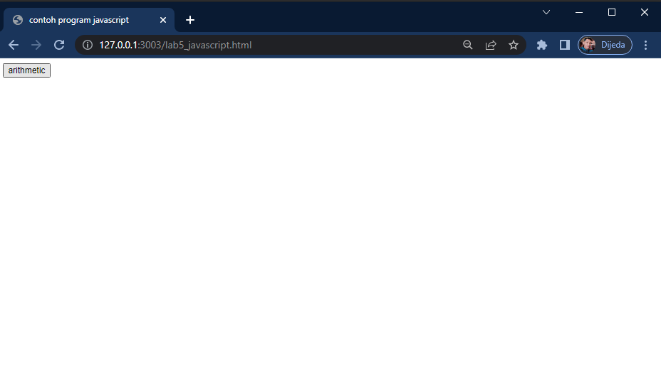

Dan hasilnya seperti ini.

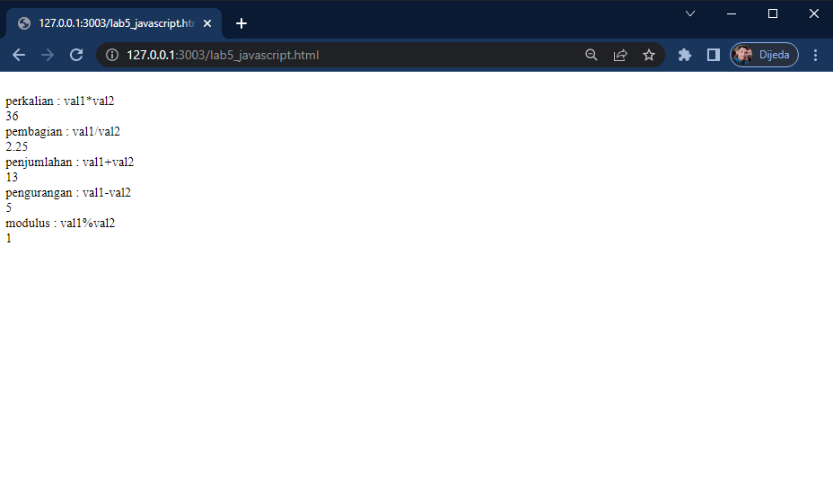

*Seleksi kondisi (If-else)*

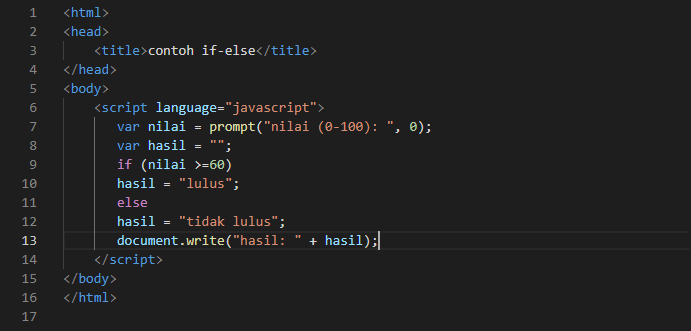

Dan hasilnnya.

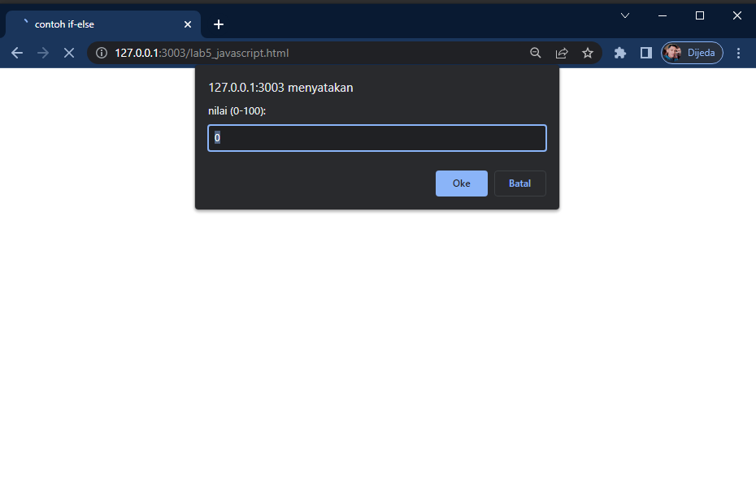

*Penggunaan Operator Switch untuk seleksi kondisi*

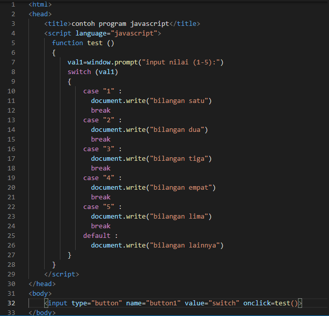

lalu klik switch

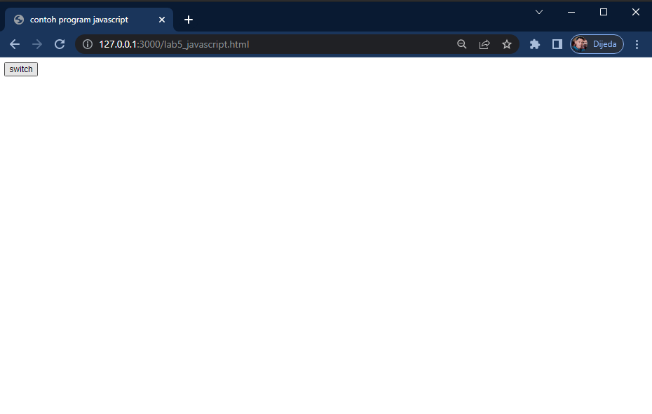

dan hasilnya sebagai berikut.

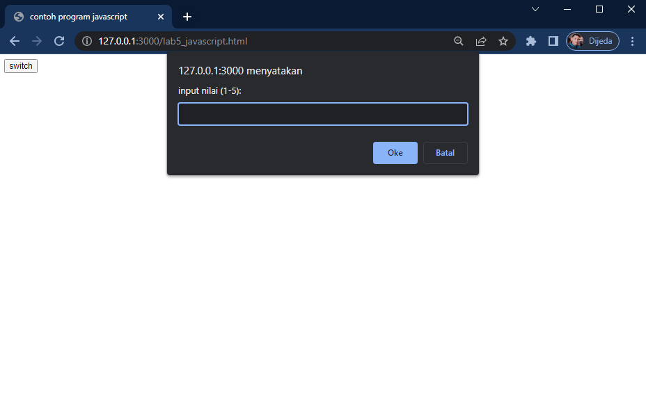

## Pembuatan from 
*from input*

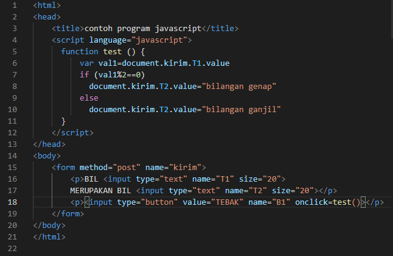

tampilannya 

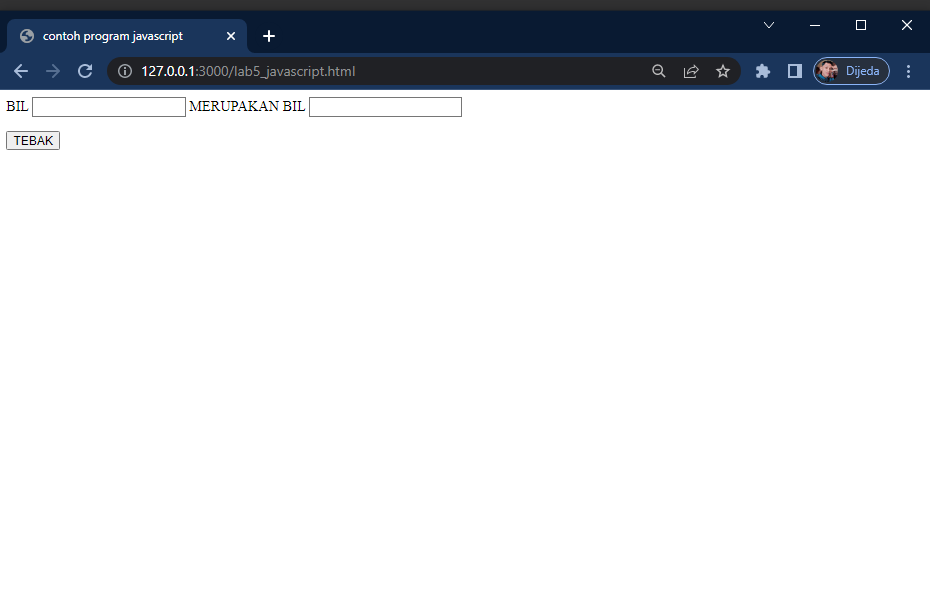

*from button*

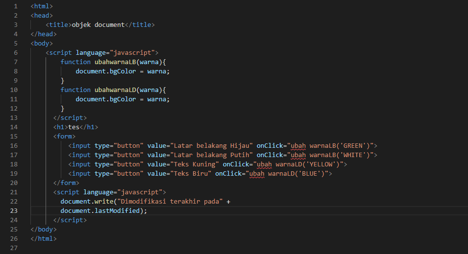

hasilnya

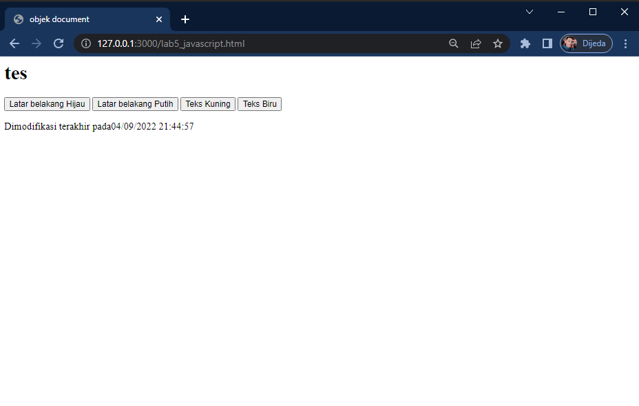

*HTML. DOM*
*Pilihan menggunakan checkBox dengan perhitungan otomatis*

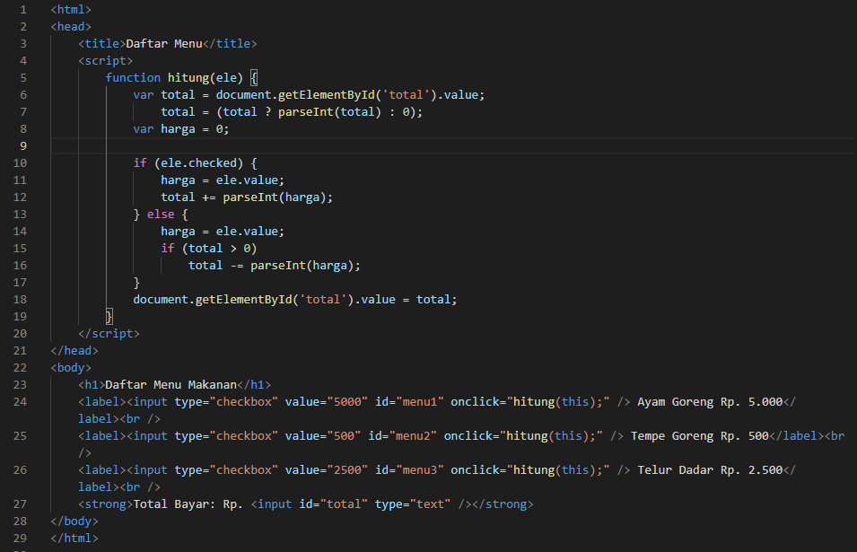

Tampilannya Daftar menu sebagai berikut.

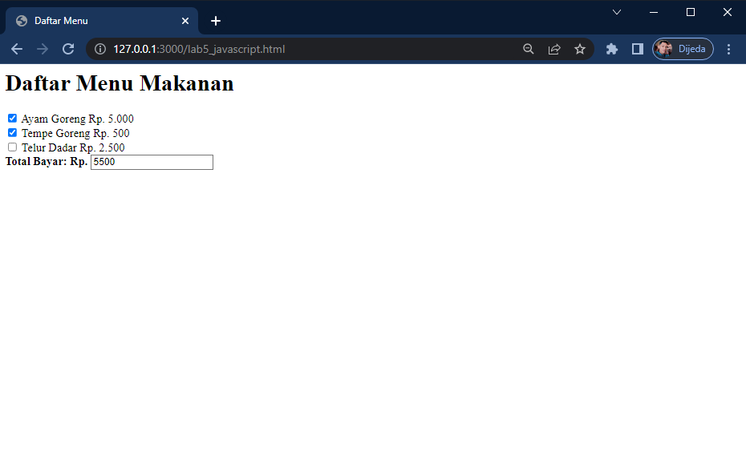

## Pertanyaan dan Tugas
1. Buat script untuk melakukan validasi pada isian form.
